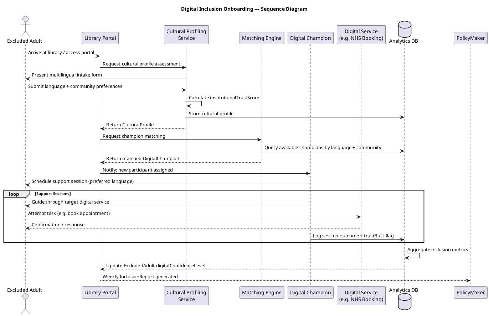
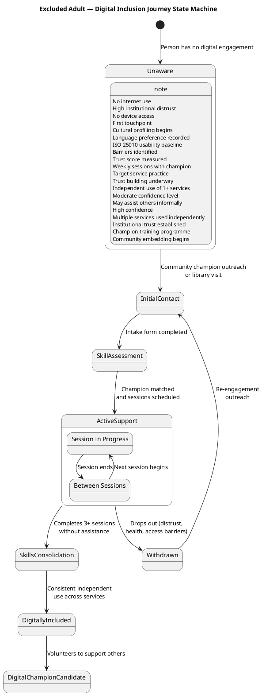
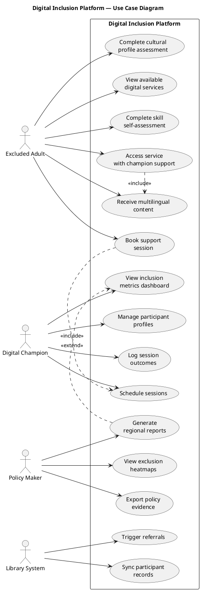

# UML Artefact Suite
## Digital Inclusion Platform — System Diagrams

All diagrams use PlantUML syntax. Render at https://plantuml.com/plantuml or paste into any PlantUML-compatible tool.

---

## 1. Class Diagram

```plantuml
@startuml class_diagram
title Digital Inclusion Platform — Class Diagram

skinparam classAttributeIconSize 0
skinparam style strictuml

package "User Domain" {
  abstract class User {
    +id: UUID
    +name: String
    +preferredLanguage: String
    +culturalProfile: CulturalProfile
    +register(): void
    +updateProfile(): void
  }

  class ExcludedAdult extends User {
    +ageGroup: AgeGroup
    +digitalConfidenceLevel: Int
    +communityAffiliation: String
    +assessSkillLevel(): SkillAssessment
  }

  class DigitalChampion extends User {
    +languages: List<String>
    +communityArea: String
    +certifications: List<String>
    +supportSessions: List<Session>
    +scheduleSupportSession(): Session
  }

  class PolicyMaker extends User {
    +organisation: String
    +accessLevel: AccessLevel
    +viewAnalytics(): Report
  }
}

package "Cultural Profile" {
  class CulturalProfile {
    +ethnicity: String
    +primaryLanguage: String
    +englishProficiency: ProficiencyLevel
    +institutionalTrustScore: Float
    +preferredCommunicationStyle: String
  }

  enum ProficiencyLevel {
    NONE
    BASIC
    INTERMEDIATE
    FLUENT
  }
}

package "Service Domain" {
  class DigitalService {
    +id: UUID
    +name: String
    +provider: String
    +supportedLanguages: List<String>
    +accessibilityRating: Float
    +usabilityScore: Float
    +getLocalizedVersion(lang: String): LocalizedService
    +assessCulturalSuitability(profile: CulturalProfile): Float
  }

  class Session {
    +id: UUID
    +champion: DigitalChampion
    +participant: ExcludedAdult
    +service: DigitalService
    +date: DateTime
    +outcome: SessionOutcome
    +trustBuilt: Boolean
    +recordOutcome(): void
  }

  class SkillAssessment {
    +userId: UUID
    +iso25010UsabilityScore: Float
    +barriersIdentified: List<Barrier>
    +recommendedInterventions: List<Intervention>
    +generateReport(): Report
  }
}

package "Analytics" {
  class InclusionReport {
    +region: String
    +period: DateRange
    +exclusionRate: Float
    +demographicBreakdown: Map<String, Float>
    +barrierAnalysis: List<Barrier>
    +generate(): PDF
  }

  class Barrier {
    +type: BarrierType
    +severity: Float
    +affectedGroups: List<String>
  }

  enum BarrierType {
    LANGUAGE
    TRUST
    DEVICE_ACCESS
    CONNECTIVITY
    SKILL
    CULTURAL
  }
}

User "1" --> "1" CulturalProfile
Session "many" --> "1" DigitalChampion
Session "many" --> "1" ExcludedAdult
Session "1" --> "1" DigitalService
ExcludedAdult "1" --> "many" SkillAssessment
InclusionReport "1" --> "many" Barrier

@enduml
```

---

## 2. Sequence Diagram

---

## 3. State Machine Diagram

---

## 4. Use Case Diagram

